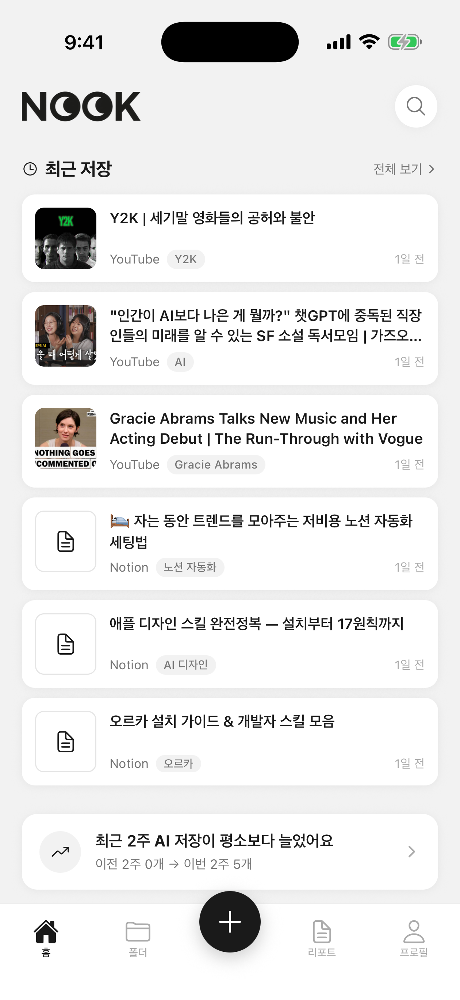
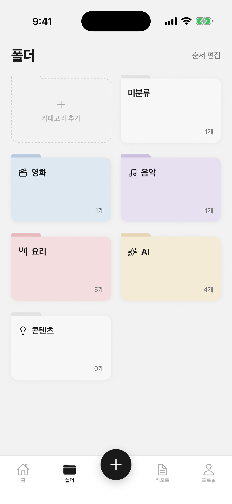
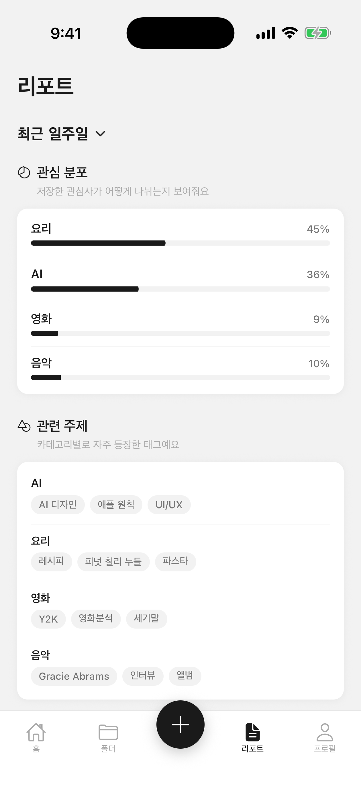
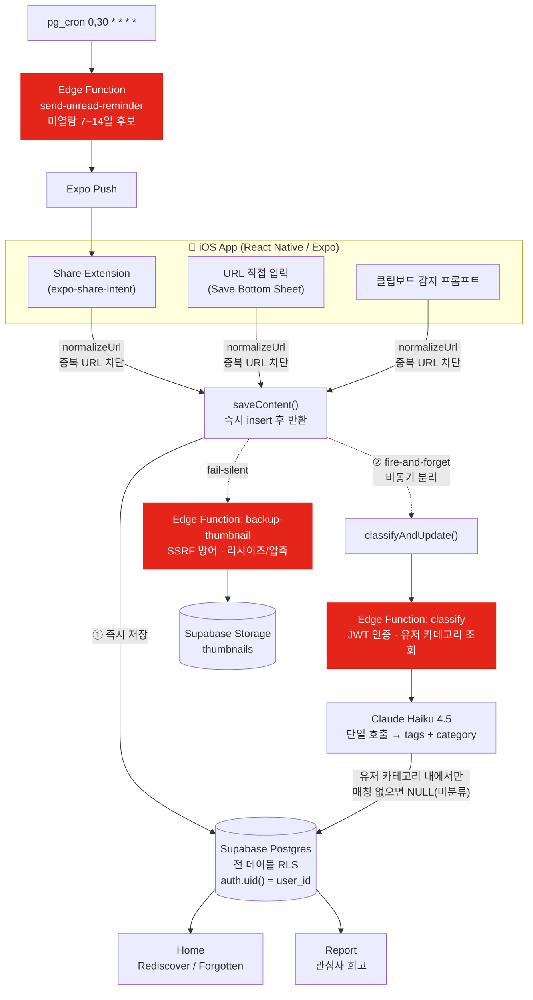

# Nook

> 흩어진 콘텐츠를 빠르게 저장하고, AI가 자동으로 분류하고, 저장해두고 잊어버린 콘텐츠를 다시 발견하도록 돕는 AI 기반 개인 아카이브 iOS 앱.
> _every nook and cranny_


<p align="center">
  
  
  
</p>

---

## 개요

| | |
|------|------|
| 플랫폼 | iOS — [App Store](https://apps.apple.com/kr/app/nook-every-nook-and-cranny/id6782843579) |
| 역할 | 기획 · 디자인 · 프론트엔드 · 백엔드 · 배포 (1인) |
| 기술 스택 | React Native(Expo) · Supabase(Auth/Postgres/RLS/Storage/Edge Function) · Claude Haiku 4.5 |
| 규모 | 화면 20개 · DB 마이그레이션 20개 · Edge Function 4개 |

📄 **상세 케이스 스터디** → [Notion](https://nookarchive.notion.site/Nook-AI-iOS-3a70026abaeb805d8955f2a9a8823145)

---

## 핵심 플로우

- 저장 진입 3경로: 공유 시트 · URL 직접 입력 · 클립보드 감지
- 저장은 즉시 반환, AI 분류는 비동기 처리



---

## 기술 하이라이트

- **저장 / AI 분류 비동기 분리** — 저장은 insert 즉시 반환, 분류는 fire-and-forget 처리. 외부 API 지연·실패가 저장 UX에 영향 없음
- **RLS 이중 방어** — 전 테이블 RLS(`auth.uid() = user_id`) + 모든 쿼리 `requireUserId()` 경유. 앱 코드가 틀려도 DB가 최종 방어선
- **AI 키 서버 이전 + Edge Function 분류** — Anthropic API 키를 클라이언트 번들에서 제거, Edge Function으로 이전. AI 반환 카테고리도 유저 카테고리 내로 제한해 파편화 방지
- **URL 정규화** — 추적 파라미터 제거 + YouTube 캐논 폼 통일로 `unique(user_id, url)` 제약이 실제 중복을 차단
- **보안 리뷰 반영** — SSRF · timing-safe 비교 · CORS · 계정 삭제 시 데이터 잔존 등 리뷰 발견 이슈를 출시 전 수정

각 항목의 배경과 트레이드오프는 [케이스 스터디](https://nookarchive.notion.site/Nook-AI-iOS-3a70026abaeb805d8955f2a9a8823145)에 정리.

---

## 기술 스택

| 영역 | 사용 기술 |
|------|-----------|
| Framework | React Native (Expo) |
| Build | Expo Development Build · EAS |
| 저장 진입 | expo-share-intent (공유 시트) |
| Backend | Supabase — Auth · Postgres · RLS · Storage · Edge Function (Deno) |
| AI | Supabase Edge Function `classify` → Claude Haiku 4.5 |
| 푸시 | expo-notifications · Expo Push · pg_cron |
| 언어 | TypeScript |

---

## 폴더 구조

```
nook/
├── app/                  # Expo Router 화면
│   ├── (tabs)/           # Home · 폴더 · Report · Profile
│   ├── content/[id].tsx  # Content Detail
│   └── category/[id].tsx # Category Detail
├── components/           # 공통 컴포넌트
├── lib/                  # supabase · api · ai · metadata · notifications ...
├── prompts/              # AI 프롬프트 버전 관리
├── supabase/
│   ├── functions/        # classify · backup-thumbnail · send-unread-reminder · cleanup-push-receipts
│   └── migrations/       # 001 ~ 020
├── types/
└── constants/            # 색상 · 폰트 · radius 토큰
```

---

## 로컬 실행

- Share Extension이 Expo Go 미지원 → Development Build 필요

```bash
npm install --legacy-peer-deps
node node_modules/expo/bin/cli start   # npx expo 대신 이 경로 사용
```

- 필요한 환경 변수(`.env`):

```
EXPO_PUBLIC_SUPABASE_URL
EXPO_PUBLIC_SUPABASE_ANON_KEY
EXPO_PUBLIC_GOOGLE_IOS_CLIENT_ID
EXPO_PUBLIC_GOOGLE_WEB_CLIENT_ID
```

> Anthropic API 키는 클라이언트에 두지 않고 Supabase Edge Function secret으로 관리.
